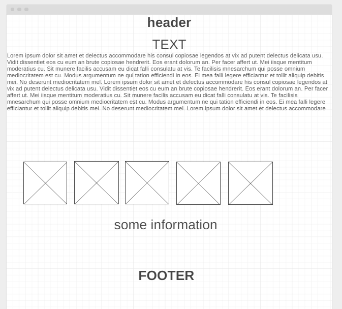

# The Free Health Is Right For Everyone

### Ibn-Sina Team members

1. ***Ishaq Alathamneh***
1. **Aya Azzam**
1. **Mohammad Momani**
1. **Alaa Hamdan**
1. **Naeem Musamh**

### Description

**Our project revolves around helping patients who cannot afford the cost of their medication, as there are many expensive medicines and it is possible through our page to help from the whole world They can donate an amount to buy the medicine or donate the medicine itself.**

### Deploy Link

[Live Server](https://naeemmusamh23.github.io/Medicine/)

### wiremframes

1. Main Page: .
1. Medicine: .
1. Donate: .
1. About Us: .

### Domain modeling

### Resources

1. [First one](https://drugsjo.blogspot.com/2019/09/ezura.html)
1. [Second one](https://altibbi.com/%D8%A7%D9%84%D8%A7%D8%AF%D9%88%D9%8A%D8%A9/%D8%B3%D8%A7%D9%86%D8%AF%D9%8A%D9%85%D9%8A%D9%88%D9%86-%D9%86%D9%8A%D9%88%D8%B1%D8%A7%D9%84)